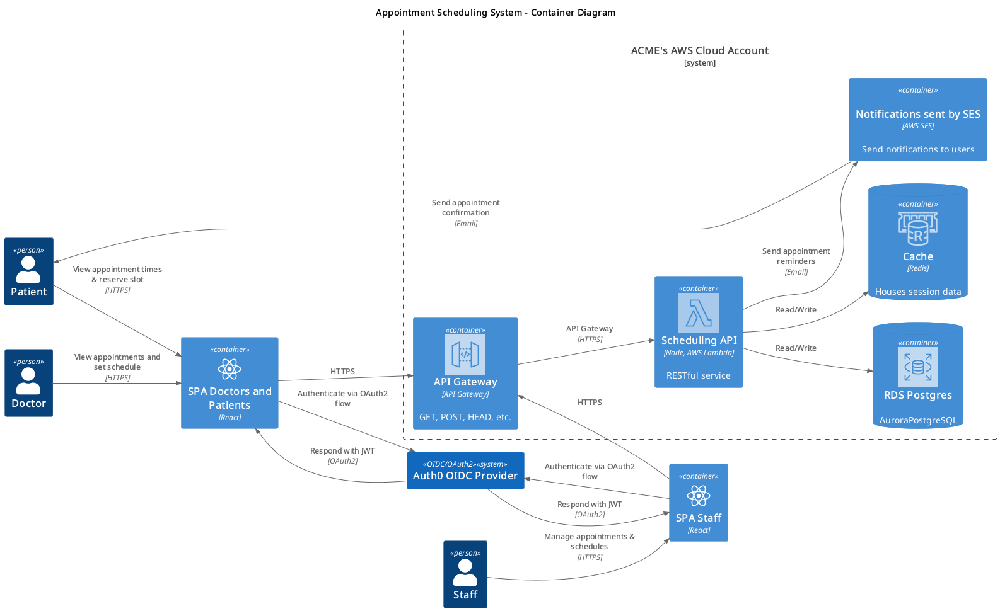

# Scheduling System API using Skip Update Locks with PostgresSQL DB.

Here is my design for the Appointment Scheduling System, it is a [C4 Container](https://c4model.com/diagrams/container) written and rendered using PlantUML. I have divided its explanation in a few sections beneath the diagram. 

You will see that the three system actors - Doctors, Patients and Staff - each interact with React Single Page Applications. I have assigned a separate frontend for Staff to satisfy the 7th requirement of the document ("The system should provide an admin interface for clinic staff ...") although this is being very literal and I would clarify this if I had access to the requirements maker, to see if the design could simply use one frontend. A single SPA is otherwise shared by Doctors and Patients. 

Doctors, Patients and Staff are all recognised by OAuth2, their roles being expressed in a fields within a JWT body, after authenticating via OIDC using AuthX (see below in [security](#security)).

Of the 7 requirements The system design challenge lists, two are [non-functional](https://en.wikipedia.org/wiki/Non-functional_requirement), the rest are functional. Reqirements 4 and 5 in the document are non-functional and relate to scalability, low latency, fault tolerance and recoverability. For this I am leaning upon AWS and choosing cloud native solutions.

## AWS Pieces

### Scalability and Low Latency

Without further information about how scalable the system should be I think that [Lambda's scalability](https://docs.aws.amazon.com/lambda/latest/dg/lambda-concurrency.html) should be a good initial approach. Lambdas, of course, have concurrency limits, which can be lifted at an account level if needed. 

API Gateway is used to front the Lambda, which will require API keys for each of the SPAs. The API keys are not, however, aspects of security. They should be used for rate limiting. 

Latency will be the cost of time for the roundtrip between the SPA, the Lambda, Redis, and PostgreSQL when necessary. This can be kept low as a programming requirement when the system is implemented. Redis is configured to run as in memory caching layer, to help with speed. It is possible to do away with having Redis if cost was something to reduce by treating PostgreSQL as a session store. 

### Failover and Resilience

RDS can be deployed as [Multi AZ](https://docs.aws.amazon.com/AmazonRDS/latest/UserGuide/Concepts.MultiAZSingleStandby.html). This is the simplest way to ensure that there is failover at at the database level.

When discussing failover the usual strategy is to ensure that the application can be deployed in different geographical locations, in case a given data centre experiences downtime. Patterns such as "active-active" and "active-passive" can be employed, each with a financial cost. The requirement doesn't state how much downtime is permissable. Given this, I would assume that the simplest option of relying on Multi AZ for fault tolerance would be a reasonable starting point, with more advanced failover patterns to be considered if deemed necessary after clarification with the requirements maker.

## Security

An OIDC Provider (OpenID Connect) will need to be configured to *authenticate* users. OIDC is build on top of OAuth2 to allow for *authentication*, whereas OAuth2 is for *authorization* (authz). Importantly, the end result of an authn sequence via an OIDC provider will result in a JWT holding claims about the "subject", and it is here that the role of Doctor, Patient and Staff can be discovered and used for authz. 

For this solution I am nominating Auth0's [Authorization Code Flow With Proof Key for Code Exchange (PKCE)](https://auth0.com/docs/get-started/authentication-and-authorization-flow/authorization-code-flow-with-pkce) which is designed to be used for SPA's interacting with backends. This OAuth flow this will result in an access token being handed to the SPA, which it will then communicate to the backend API via the HTTP Header key value pair: `Authorization: Bearer <token>`. The backend will then need to validate and verify the token with Auth0's API. Once this is done, the backend will have authorized the SPA's data and one of several strategies can be used to avoid reauthorising with each HTTP request and response - the backend, could, for example, set a [secure cookie](https://developer.mozilla.org/en-US/docs/Web/Security/Practical_implementation_guides/Cookies). Here, I have nominated that the cookie can be stored in Redis with a reasonable Time To Live that suits the purpose of the session, say half an hour.

## Aspects of Business Logic 

This backend must have a data model and strategies for 

1. storing Doctor schedules, which are effectively time "slots". The size of time slots has not been specified so we will assume 15 minutes (but this should be a variable within the system, not a magic number).
2. storing Patient appointments in "slots"
3. allowing Patients to change an appointment
4. allowing Staff to change appointments and schedule slots. This is a "on behalf of" action, which could have interesting aspects in other domains (such as staff being allowed to act on on behalf of a client in a bank) but we will keep it simple as a blanket "Staff can change anything" ability here.
5. when an appointment is changed there needs to be a decision about what should happen to the previous slot, it would normally be freed
6. when a slot is changed there needs to be an automatic reassigment of the appointment to another slot, see Point 9 - if some slots become free within the 24 hour freeze period then Staff will probably have to curate them manually
7. whenever an appointment is assigned to a slot, there should be a notification event sent to the Notification System that means the Patient is notified. Ideally, there might be a sensible delay on notifications being sent out, so deduplication can occur and Patients are not spammed with notifications if an appointment is changed many times in a short duration. 
8. consideration could be given to protection from abuse - i.e. how many times can a Patient change their appointment and thus trigger a cycle from e to g above?
9. there should be a lock on an appointment for n hours (normally 24) that means the Patient can longer change the time slot.
10. Staff configuring public holidays when the schedule cannot operate

I am also assuming that Doctors will not also be Patients, so there is no chance they can book their own time slot.

## Notifications

For Point 7, I have chosen to use Simple Email Service. I have not used this system previously in AWS but it seems pragmatic. Another option would be to use SNS. 

## Race Conditions and the Skip Lock

An interesting aspect of this design lies in assigning appointments to slots when scaling lambdas horizontally. When multiple lambdas are running in parallel for Patients wanting to book the same appointment there will be a race condition for the same time slot. Postgres' skip lock could be used for a simple solution to this: see the ["Locking Clause" section](https://www.postgresql.org/docs/current/sql-select.html). This [article](https://www.inferable.ai/blog/posts/postgres-skip-locked) describes it friendlier terms. 

The skip lock solution would most likely be used when a Patient clicks on a given slot and the SPA goes through a confirmation sequence, displaying a page of appointment details that needs confirmation. If the lock is acquired as the confirmation page loads, the Patient will have a reserved slot, otherwise the Patient will have to select another slot until they can go into confirmation mode.

The skip lock will mean the database is not a blocking layer, which will contribute to lower latency in the system.

